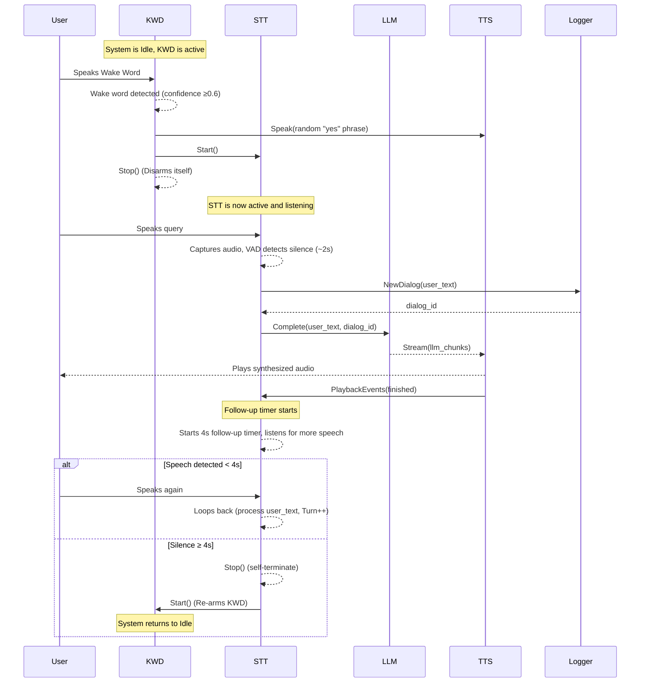

# System Architecture Specification (v2.0)

This document provides a unified overview of the system architecture, incorporating all design decisions from detailed specifications for the loader, dialog flow, logger, and dynamic RMS services.

## 1\. System Overview

The system is composed of several independent services running on localhost that communicate via gRPC. A central `loader` service manages the lifecycle (startup, shutdown, restart) of all other services, but it does not participate in the runtime dialog logic. The conversation flow is managed directly by the services themselves in a choreographed, STT-led sequence.

  * **Processes (localhost, separate):** `main`, `loader`, `kwd`, `stt`, `llm`, `tts`, `logger`, `rms`.
  * **Ports:** 5000 (logger), 5001(loader), 5002 (kwd), 5003 (stt), 5004 (llm), 5005(tts), 5006 (rms). *Note: KWD port 5003 in `spec.md` conflicts with `loader_spec.md`'s LLM port 5003; this version uses the more detailed port map.*
  * **IPC:** gRPC (domain APIs) + `grpc.health.v1.Health` per service.
  * **Security:** Services bind to 127.0.0.1 only; no external calls.

## 2\. Startup & Greeting Sequence (Loader-Controlled)

The `loader` starts services sequentially to ensure stability and proper resource allocation. The sequence is gated, meaning the next service begins starting only after the previous one is confirmed to be ready.

### 2.1. Startup Order

1.  **Start `rms`:** The Dynamic RMS service starts first so that noise readings are available to `kwd` and `stt` before they need to arm their audio inputs.
2.  **Start `kwd`:** The Keyword Detection service.
3.  **Start `stt`:** The Speech-to-Text service.
4.  **Start `llm`:** The Large Language Model service.
5.  **Start `tts`:** The Text-to-Speech service.
    *(The full startup sequence is defined as `["kwd", "stt", "llm", "tts"]`, with `rms` added as a precursor).*

### 2.2. System Ready & Post-Boot Greeting

The loader orchestrates a coordinated greeting to signal that the entire system is operational.

1.  **SYSTEM\_READY State:** After the last service (`tts`) is ready and all warm-ups are complete, the `loader` enters the `SYSTEM_READY` state.
2.  **Greeting Initiation:** The loader notifies the `KWD` service that the system is ready.
3.  **KWD Triggers Greeting:** The `KWD` service temporarily pauses its own wake-word detection to prevent self-triggering and calls the `TTS` service to speak the configured greeting (e.g., "Hi Master. Ready to serve.").
4.  **Wake Word Activation:** Upon receiving a `tts_finished` event, the `KWD` service waits for a brief guard period (`~150ms`) and then enables wake-word listening. The system is now in an **Idle** state, ready for user interaction.

## 3\. Runtime Data Flow (STT-Led Dialog)

The dialog loop is managed by `STT`.

## 4\. Service Responsibilities & Modules

### `loader`

  * **Purpose:** Manages the lifecycle of all other services.
  * **Responsibilities:**
      * Starts services in a defined sequential order (`rms`, `kwd`, `stt`, `llm`, `tts`).
      * Performs port and process hygiene before startup to ensure a clean state.
      * Monitors VRAM usage and service health.
      * Restarts services on failure according to a backoff policy.
      * Orchestrates the post-boot greeting by signaling `KWD` upon reaching `SYSTEM_READY` state.
      * **Does NOT** handle any runtime dialog logic.

### `kwd` (Keyword Detection)

  * **Purpose:** Listens for a wake word to initiate interaction.
  * **Responsibilities:**
      * Upon detecting a wake word:
        1.  Calls `TTS` to speak a randomized confirmation phrase (e.g., "Yes, Master?").
        2.  Calls `Logger` to get a new `dialog_id`.
        3.  Calls `STT.Start()` to begin the dialog loop.
        4.  Calls `KWD.Stop()` on itself to disarm during the conversation.
      * Receives the `on_system_ready` signal from the loader to trigger the initial greeting.
      * Before arming, pulls the latest noise reading from the `rms` service to dynamically adjust its sensitivity threshold.

### `stt` (Speech-to-Text)

  * **Purpose:** Transcribes user speech and manages the entire dialog loop.
  * **Responsibilities:**
      * Owns the dialog loop: captures audio until a silence of \~2 seconds is detected.
      * On receiving user text, it calls `LLM.Complete` and pipes the resulting stream of text chunks directly to `TTS.SpeakStream`.
      * Subscribes to `TTS.PlaybackEvents` to detect when the assistant has finished speaking.
      * After TTS finishes, it starts a **4-second follow-up timer** and listens for more speech.
      * If speech occurs within 4 seconds, the loop continues for another turn.
      * If 4 seconds of silence elapse, it ends the dialog by stopping itself and calling `KWD.Start()` to re-arm the wake word listener.
      * Pulls noise readings from `rms` to adapt its VAD (Voice Activity Detection) "silence" threshold.

### `llm` & `tts` (Language Model & Text-to-Speech)

  * **Purpose:** Generate responses and synthesize speech.
  * **Responsibilities:**
      * Act as simple request/response or streaming services.
      * Have no internal dialog logic; they are controlled by `STT`.

### `rms` (Dynamic RMS)

  * **Purpose:** A lightweight sidecar service that measures ambient room noise.
  * **Responsibilities:**
      * Continuously captures audio from a microphone to calculate the real-time RMS and a smoothed `noise_floor_db`.
      * Provides a gRPC endpoint (`GetCurrentRms`) for other services to pull the latest readings.
      * Enables `kwd` and `stt` to adapt their audio detection thresholds to the environment, reducing false wakes in noisy rooms and increasing sensitivity in quiet rooms.

### `logger`

  * **Purpose:** Provides a centralized sink for application and dialog logging.
  * **Responsibilities:**
      * Writes structured logs to files (`app.log`, `dialog_*.log`).
      * Echoes key system events to the console in a standardized, human-readable format.
      * **Console Format:** `{SERVICE:<10}{LEVEL:<6}= {MESSAGE}`.
          * Example: `KWD       INFO  = Wake word detected (confidence 0.82)`.
          * Timestamps and verbose debug messages are omitted from the console but are present in log files.

## 5\. Configuration Highlights

The system is configured via INI or YAML files, with key sections for each service.

  * **`[loader]`**: Defines startup/shutdown sequences, service timeouts, and restart policies. Includes `post_boot_greeting` configuration.
  * **`[rms]`**: Configures audio device, sample rate, and parameters for noise floor calculation (`window_sec`, `floor_mode`).
  * **`[adaptive]`**: Contains settings for `kwd` and `stt` to interpret `rms` readings, such as `quiet_dbfs`, `noisy_dbfs`, and sensitivity factors.
  * **`[logger]`**: Controls console output verbosity, colors, and timestamp visibility.
  * **`[kwd]` / `[stt]`**: Define `base_rms_threshold` which is dynamically adjusted using values from the `rms` service.